# Лабораторная работа №1. Установке виртуальной машины и Ubuntu на Windows
 
 - **Калинкова София, I2302** 
 - **26.09.2025** 

## Цель работы

Освоить процесс создания виртуальной машины и установки Ubuntu (Desktop) на платформе Windows (VirtualBox), а также настроить интеграцию гостевой ОС с хостом (сеть, общие папки, инструменты гостя), выполнить базовую проверку работоспособности и создать резервную точку (snapshot).

## Ход работы

### Установка Ubuntu на виртуальную машину в Windows

#### 1. Установка VirtualBox

1. Перехожу на официальный сайт VirtualBox: [https://www.virtualbox.org/wiki/Downloads](https://www.virtualbox.org/wiki/Downloads)
2. Скачиваю установщик для Windows.
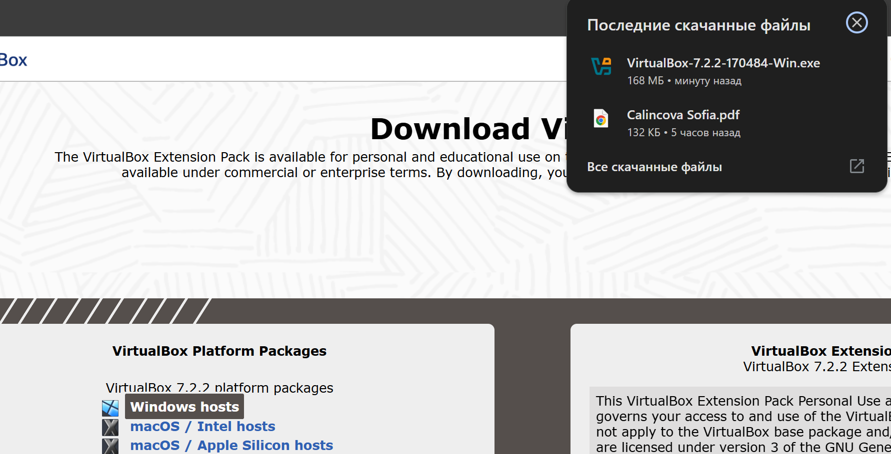
3. Запускаю скачанный файл (.exe).
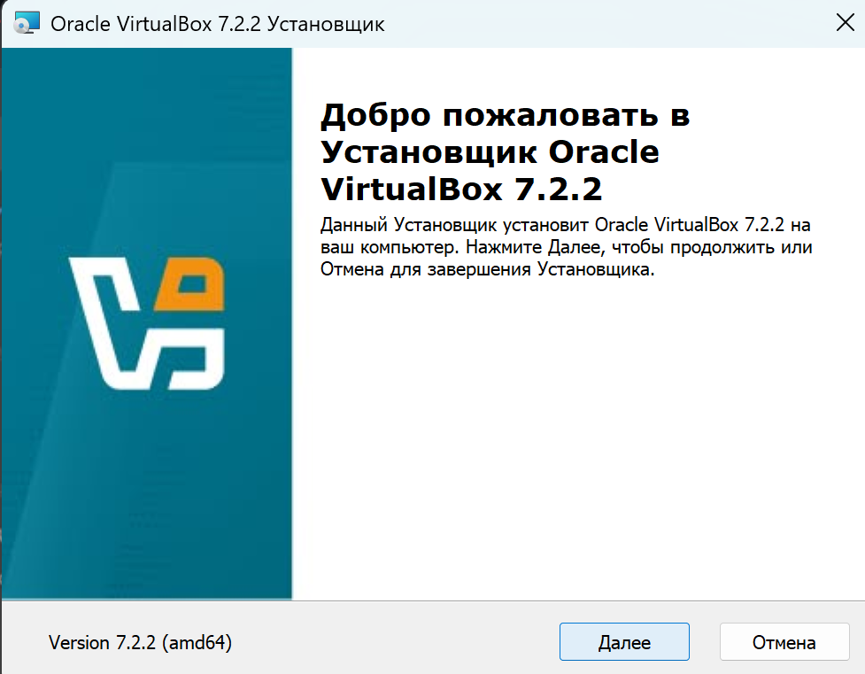
4. Следую инструкциям мастера установки:
    - Приминяю лицензию.
    - Оставляю компоненты по умолчанию.
    - Подтверждаю предупреждения о сетевых интерфейсах.
    - Разрешаю установку драйверов, если потребуется.
5. После завершения нажимаю «Готово» и открываю VirtualBox.
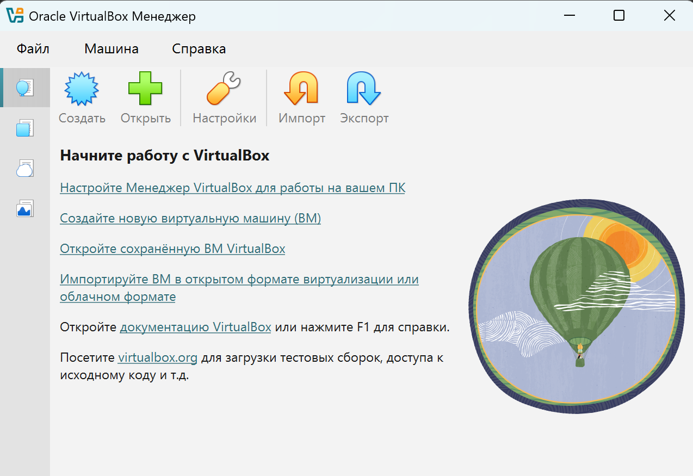

## 2. Загрузка ISO-образа Ubuntu

1. Перехожу на [https://ubuntu.com/download/desktop](https://ubuntu.com/download/desktop).
2. Скачиваю Ubuntu Desktop ( Ubuntu 24.04 LTS).
3. Сохраняю ISO-файл в удобном месте.

## 3. Создание виртуальной машины

1. Открываю VirtualBox.
2. Нажимаю «Создать» (New).
3. Ввожу имя, выбираю тип: **Linux**, версия: **Ubuntu (64-bit)**.
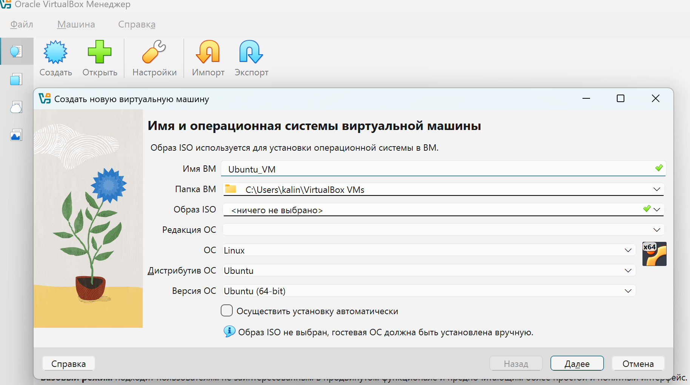
4. Выделяю оперативную память: минимум 2048 МБ (рекомендуется 4096 МБ).
5. Создаю виртуальный жесткий диск:
    - Тип: VDI (VirtualBox Disk Image)
    - Хранение: динамический.
    - Размер: минимум 20 ГБ, рекомендуется 30–50 ГБ.
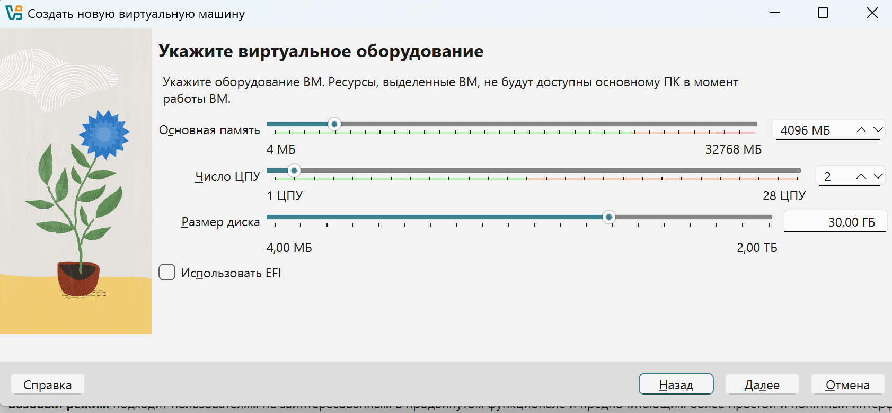
6. Завершаю создание виртуальной машины.
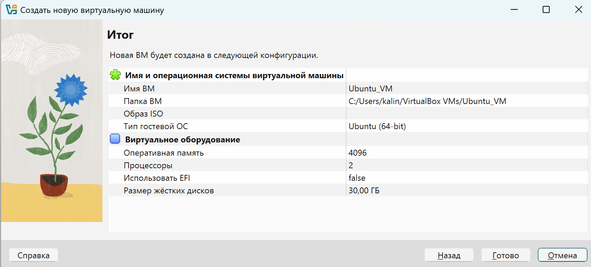

## 4. Настройка виртуальной машины

1. Выбераю созданную ВМ и нажмите «Настроить» (Settings).
2. В разделе «Система» > «Процессор»: выделяю 2 и более ядер, если возможно.
3. В разделе «Дисплей»: увеличиваю видеопамять до 128 МБ, включите 3D-ускорение.
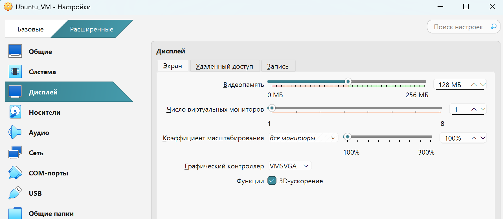
4. В разделе «Носители» (Storage): - Выбераю пустой оптический привод и нажмаю на значок диска справа и выберите скачанный ISO-файл Ubuntu.
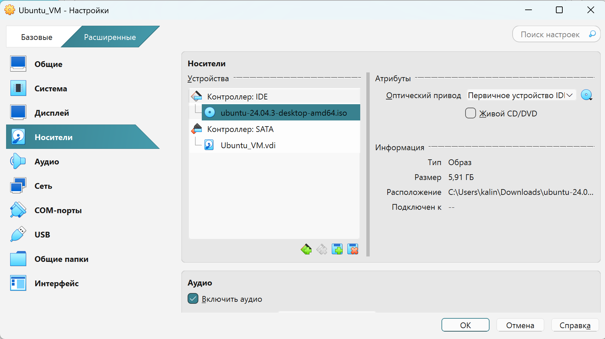
5. Сохраняю настройки.

## 5. Установка Ubuntu

1. Запускаю виртуальную машину (кнопка «Старт»).
2. В появившемся окне выбераю «Install Ubuntu».
3. Выбераю русский язык, нажмите «Continue».
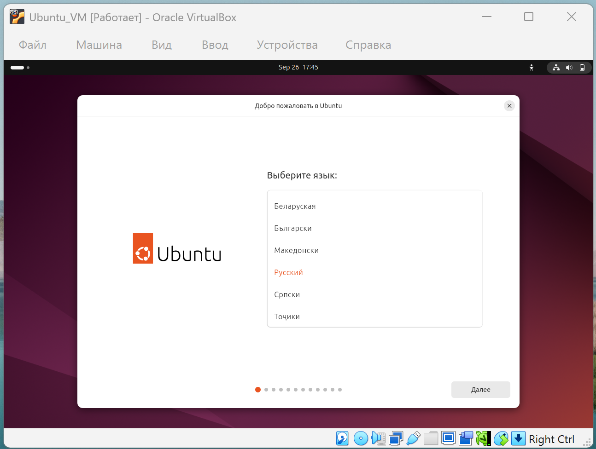
4. В разделе «Updates and other software»:
    - Выбераю «Normal installation». 
    - Отмечаю «Download updates while installing Ubuntu».
5. В разделе «Installation type»:
    - Выбераю «Erase disk and install Ubuntu» (это касается только виртуального диска).
    - Подтверждаю изменения.
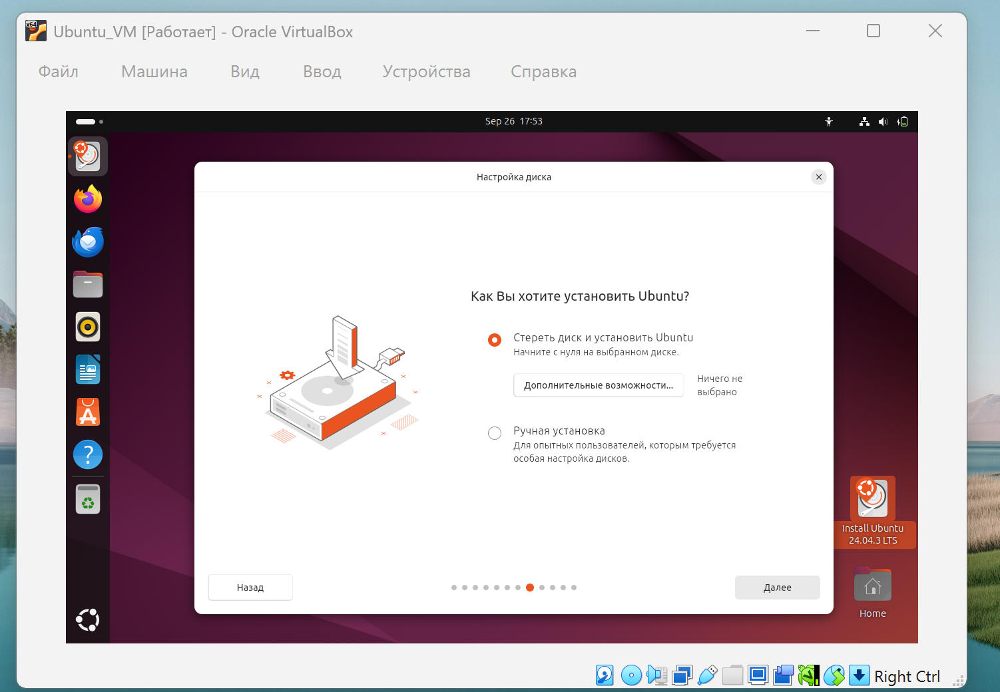
6. Выбераю часовой пояс.
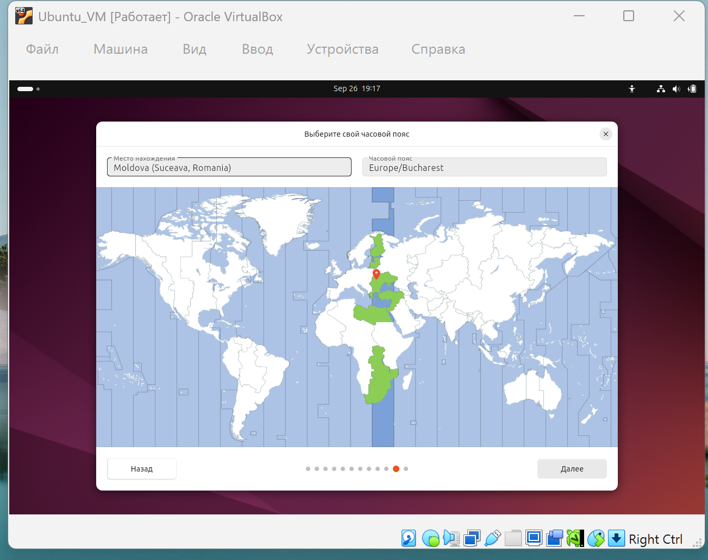
7. Создаю пользователя, задайте пароль.
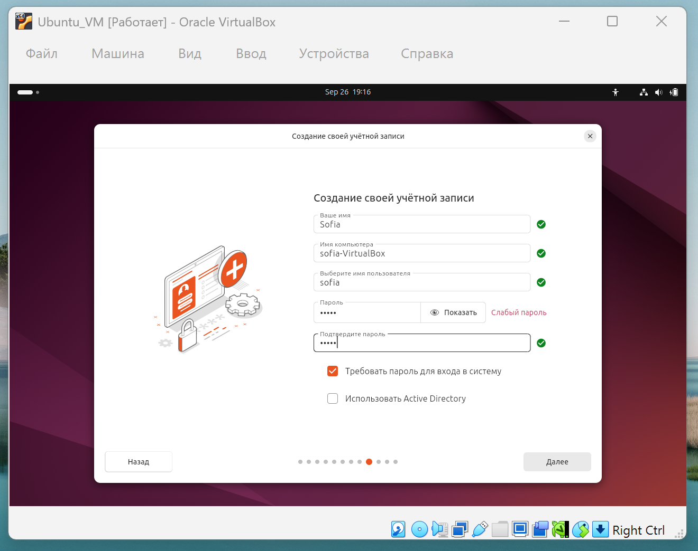
8. Дожидаюсь завершения установки, нажимаю «Restart Now».
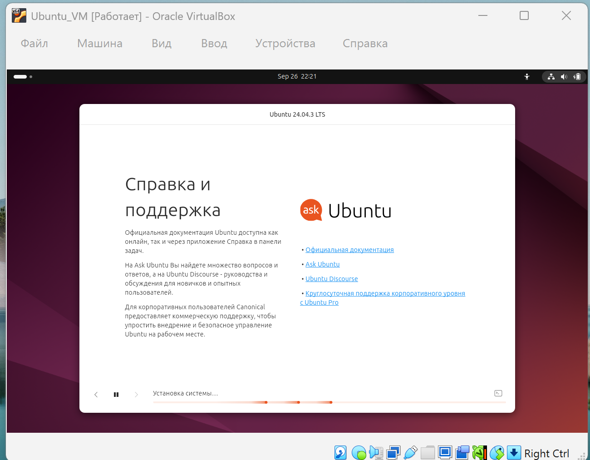
9. При появлении запроса на извлечение установочного носителя — просто нажимаю Enter.

## 6. Установка Guest Additions (рекомендуется)

1. После загрузки Ubuntu вхожу в систему.
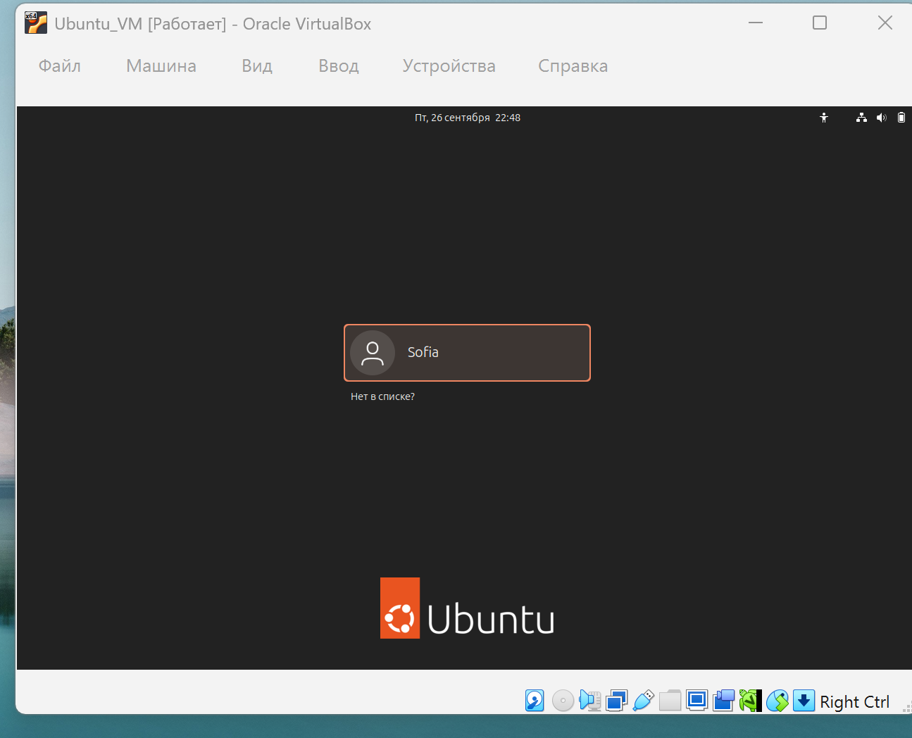
2. В меню VirtualBox выбераю «Устройства» → «Подключить образ диска Дополнений гостевой ОС».
3. В Ubuntu открывается окно файлового менеджера. Открываю терминал в этой папке.
4. Выполняю команды:
    ```bash
    sudo apt update 
    sudo apt install -y build-essential dkms linux-headers-$(uname -r) 
    cd /media/$USER/VBox_GAs_* 
    sudo ./VBoxLinuxAdditions.run 
    sudo reboot
    ```
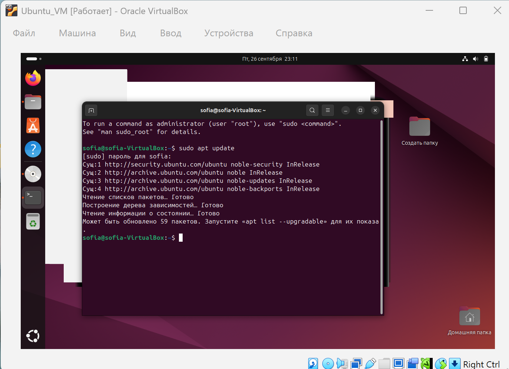
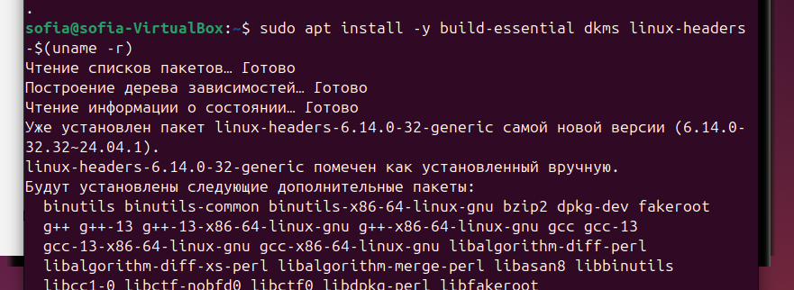
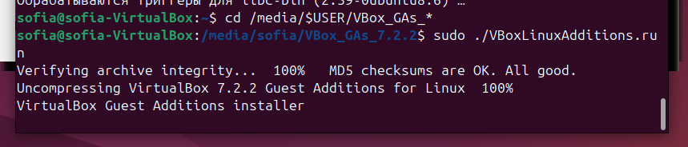
5. После перезагрузки интеграция мыши, буфера обмена и экрана работают лучше. 

## Вывод 

В ходе лабораторной работы был рассмотрен процесс установки и настройки виртуальной машины с операционной системой Ubuntu на базе VirtualBox. Были выполнены все основные этапы: установка VirtualBox, загрузка и подключение ISO-образа Ubuntu, создание и настройка параметров виртуальной машины, установка операционной системы и дополнительных средств интеграции (Guest Additions).

В результате получена готовая к работе виртуальная среда, обеспечивающая полноценное функционирование Ubuntu в Windows и удобную интеграцию с хостовой системой. Освоены базовые навыки работы с VirtualBox, включая управление ресурсами, настройку оборудования и использование дополнительных инструментов.
