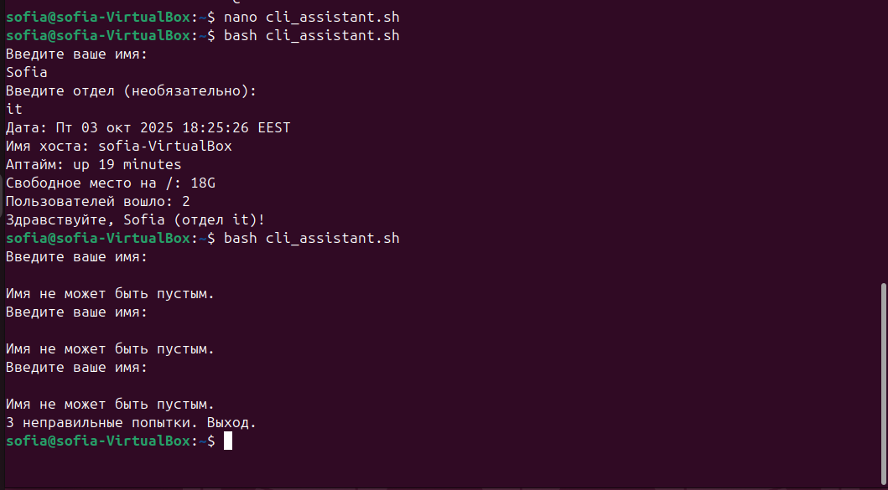
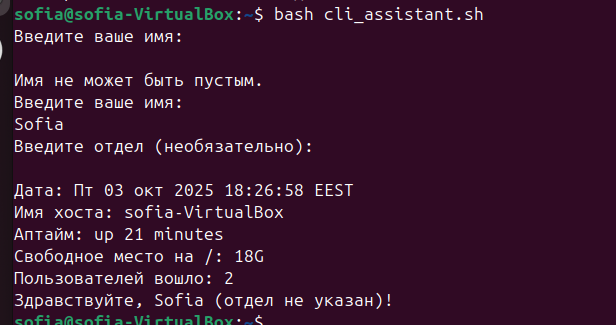
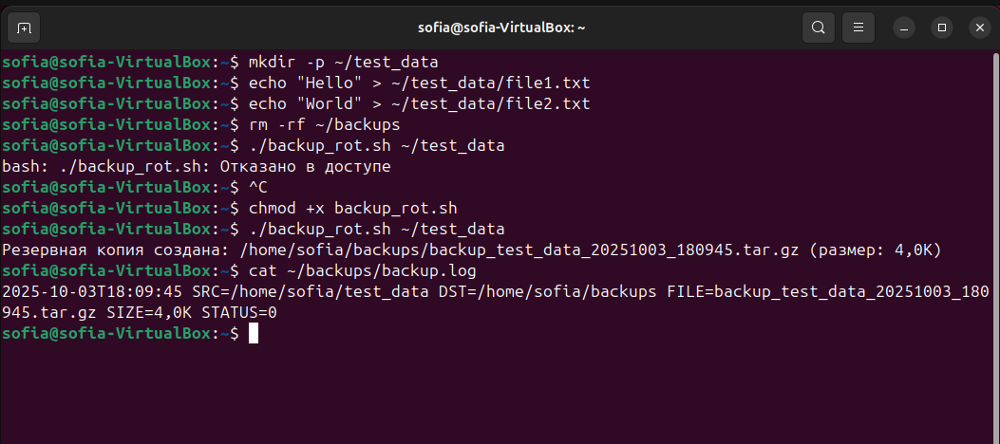
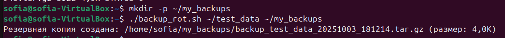
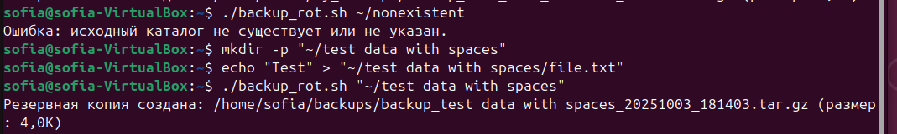
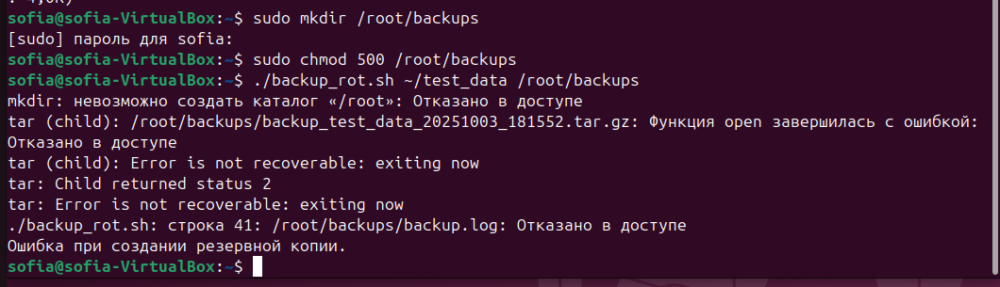
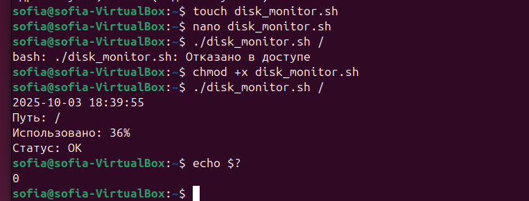
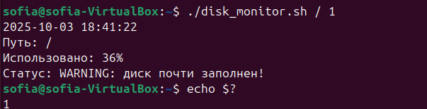
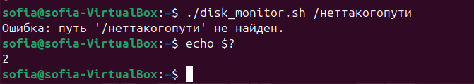

# Лабораторная работа №2
 
 - **Калинкова София, I2302** 
 - **03.10.2025** 

## Цель работы

Целью лабораторной работы является освоение основ написания и выполнения Bash-скриптов в Linux, включая работу с переменными, вводом и выводом данных, условиями, циклами и системными утилитами, а также получение практических навыков автоматизации рутинных задач, таких как взаимодействие с пользователем, резервное копирование и мониторинг состояния файловой системы.

---

## Ход выполнения работы

### Задание 1. «CLI‑ассистент: приветствие, валидация и мини‑отчёт о системе»

Написать скрипт `cli_assistant.sh`, который:

1. Спрашивает имя пользователя и (необязательно) его отдел/группу
2. Валидирует ввод (пустые значения — повторный запрос до 3 попыток).
3. Выводит мини‑отчёт:
    - текущая дата,
    - имя хоста,
    - время аптайма,
    - свободное место на `/`,
    - количество пользователей, вошедших в систему.
4. Итоговая строка: «Здравствуйте, <Имя> (<Отдел|не указан>)!».

#### Требования

- Shebang `#!/bin/bash`.
- Валидация пустого ввода с максимум 3 попытками (после — вежливый выход с кодом `1`).
- Использование командной подстановки `$(...)`.
- Только стандартные утилиты.

[Скрипт cli_assistant.sh](cli_assistant.sh)

**1. Ввод имени**
- Используется цикл `while` с проверкой `-z "$name"`.  
- Если имя пустое, выводится сообщение и счётчик попыток увеличивается (`tries=$((tries+1))`).  
- При достижении 3 неудачных попыток скрипт завершает работу с кодом `1`.

**2. Ввод отдела**
- Запрашивается дополнительно, но его можно не вводить.  
- Если строка пустая, в переменную записывается `не указан`.

**3. Вывод отчёта**
- `date` — показывает текущую дату и время.  
- `hostname` — имя хоста.  
- `uptime -p` — время работы системы в удобочитаемом виде.  
- `df -h / | awk 'NR==2 {print $4}'` — свободное место на корневом разделе. *Команда `df` показывает использование дискового пространства, ключ `-h` выводит размеры в удобном формате (К/М/Г). Фильтрация через `awk` берёт вторую строку `(NR==2)` и четвёртый столбец `($4)`, где указано свободное место на корневом разделе `/`.*
- `who | wc -l` — количество пользователей в системе. `who` отображает список вошедших пользователей. Конвейер `wc -l` подсчитывает количество строк, тем самым выдавая число активных пользователей.

**4. Итоговое приветствие**
В конце выводится строка вида: `Здравствуйте, Имя (отдел Отдел)!`

#### Тестирование

Проверка с вводом двух полей и проверка выхода из системы после 3 пустых значений.


Проверка без ввода отдела. 

### Задание 2. «Резервное копирование каталога с логированием и ротацией»

Написать скрипт `backup_rot.sh`, который:

- Принимает аргументы:
    1. Обязательный путь к каталогу‑источнику (например, `/home/student/data`).
    2. Необязательный путь к каталогу для бэкапов (по умолчанию `~/backups`).
        
- Проверяет, что источник существует и это каталог; создаёт каталог бэкапов при необходимости.
- Создаёт архив `tar.gz` с именем по шаблону:  
    `backup_<basename источника>_<YYYYMMDD_HHMMSS>.tar.gz`
- Пишет лог в `backup.log` в каталоге бэкапов (время, имя архива, размер, код возврата).
- Возвращает код `0` при успехе, `≠0` при ошибках ввода/архивации.

#### Требования
- Защита от пробелов в путях (кавычки при `tar`, `mv`, `rm`).
- Проверка доступности записи в каталог бэкапов.

#### Примеры

```shell
$ ./backup_rot.sh 
~/projects/app 
$ ./backup_rot.sh /var/www /mnt/storage/backups 5
```

#### Пример лога (фрагмент)

```shell
2025-08-23T14:45:12 SRC=/var/www DST=/mnt/storage/backups \ FILE=backup_www_20250823_144512.tar.gz SIZE=128M STATUS=0`
```
[Скрипт backup_rot.sh](backup_rot.sh)

**1. Аргументы и проверка каталогов**

- `[ -z "$DEST_DIR" ]` — проверяет, пустая ли переменная `$DEST_DIR`. Если аргумент не указан, скрипт использует каталог по умолчанию `($HOME/backups)`.

- `[ ! -d "$SRC_DIR" ]` — проверяет, существует ли каталог-источник `$SRC_DIR`. Опция `-d` возвращает `true`, если путь существует и это каталог.

- `mkdir -p "$DEST_DIR"` — создаёт каталог для бэкапов, если его нет. Опция `-p` создаёт все промежуточные папки и не выдаёт ошибку, если каталог уже существует.

**2. Формирование имени архива**

- `DATE=$(date +%Y%m%d_%H%M%S)` — сохраняет текущую дату и время в переменную `$DATE`. Формат `%Y%m%d_%H%M%S` делает имя архива уникальным.

- `BASENAME=$(basename "$SRC_DIR")` — извлекает имя последней папки из пути. Это используется для формирования понятного имени архива.

- `ARCHIVE_NAME="backup_${BASENAME}_${DATE}.tar.gz"` — собирает имя архива по шаблону: `backup_<basename>_<дата>.tar.gz.`

**3. Создание архива**

- `tar -czf "$DEST_DIR/$ARCHIVE_NAME" -C "$(dirname "$SRC_DIR")" "$BASENAME"` — создаёт архив с gzip-сжатием `(-czf)`. Опция `-C` меняет рабочую директорию перед упаковкой, чтобы в архив попало только имя папки, а не весь путь.

- `STATUS=$?` — сохраняет код возврата последней команды. Код `0` означает успешное создание архива, другие значения — ошибки.

**4. Определение размера архива**

- `du -h "$DEST_DIR/$ARCHIVE_NAME" | awk '{print $1}'` — показывает размер файла в удобочитаемом формате. `du -h` выводит размер, а `awk '{print $1}'` берёт только число.

**5. Логирование**

- `echo "$(date +%Y-%m-%dT%H:%M:%S) SRC=$SRC_DIR DST=$DEST_DIR FILE=$ARCHIVE_NAME SIZE=$SIZE STATUS=$STATUS" >> "$LOG_FILE" `— добавляет запись в лог с датой, именем архива, размером и кодом возврата. Использование `>>` гарантирует, что новые записи дописываются, а не перезаписывают файл.

**6. Вывод результата**

- `echo "Резервная копия создана: $DEST_DIR/$ARCHIVE_NAME (размер: $SIZE)"` — выводит пользователю путь и размер архива при успешной операции.

- `exit $STATUS` — возвращает код выполнения скрипта, чтобы другие программы могли определить успех или неудачу.

#### Тестирование


1. подготовка

- Создание тестовой папки с файлами:

```bash
mkdir -p ~/test_data
echo "Hello" > ~/test_data/file1.txt
echo "World" > ~/test_data/file2.txt
```

- Убеждаемся, что нет каталога бэкапов (чтобы проверить создание): `rm -rf ~/backups` удаляет папку со всем её содержимым без вопросов

2. Проверка правильного случая `./backup_rot.sh ~/test_data`

- Аргументы: только исходный каталог

- Второй аргумент не указан → должен создаться ~/backups

- *Результат:* Резервная копия создана: `/home/user/backups/backup_test_data_20251003_201230.tar.gz`

- *Проверяем лог:* `cat ~/backups/backup.log` Там строка с датой, SRC, DST, FILE, SIZE и STATUS=0


3. Проверка с указанием каталога бэкапов
```bash
mkdir -p ~/my_backups
./backup_rot.sh ~/test_data ~/my_backups
```



4. Подвох 1 — несуществующий исходный каталог
```bash
./backup_rot.sh ~/nonexistent
```

- Скрипт выводит: `Ошибка: исходный каталог не существует или не указан.`

- Код возврата: `echo $?` 1.

5. Подвох 2 — путь с пробелами
```bash
mkdir -p "~/test data with spaces"
echo "Test" > "~/test data with spaces/file.txt"

./backup_rot.sh "~/test data with spaces"
```

- Проверяем, что архив создаётся и пробелы не ломают скрипт.


6. Подвох 3 — каталог бэкапов без прав на запись
```bash
sudo mkdir /root/backups
sudo chmod 500 /root/backups

./backup_rot.sh ~/test_data /root/backups
```

Скрипт попытался создать архив и выйти с ошибкой (STATUS != 0).Лог тоже не создался.

### Задание 3. «Мониторинг дискового пространства»

Написать скрипт `disk_monitor.sh`, который:

1. Принимает аргументы:
    - путь к файловой системе (например, `/` или `/home`),
    - необязательный порог заполнения (%) — по умолчанию 80.
2. Проверяет, что путь существует.
3. С помощью `df -h` получает процент использования.
4. Выводит:
    - текущую дату/время,
    - путь и процент занятости,
    - сообщение «OK» если меньше порога, иначе «WARNING: диск почти заполнен!».
5. Возвращает код:
    - `0`, если всё в норме,
    - `1`, если превышен порог,
    - `2`, если ошибка (например, путь не найден).

#### Пример

```shell
$ ./disk_monitor.sh / 75
2025-08-23 14:55:12
Путь: /
Использовано: 42%
Статус: OK
```

[Скрипт disk_monitor.sh](disk_monitor.sh)

**1. Аргументы и порог**

- `$1` — путь к файловой системе, `$2` — необязательный порог заполнения.

- `[ -z "$THRESHOLD" ]` проверяет, был ли указан второй аргумент; если нет, используется значение по умолчанию 80%.

**2. Проверка пути**

- `[ ! -d "$FS_PATH" ]` проверяет, существует ли каталог или путь.

- Если путь не найден, скрипт выводит сообщение об ошибке и завершает работу с кодом `2`.

**3. Получение процента использования**

- `df "$FS_PATH" | awk 'NR==2 {print $5}' | tr -d '%'` берёт процент занятости файловой системы `df` показывает использование диска, `awk 'NR==2 {print $5}'` берёт вторую строку и пятый столбец `(Use%)`, а `tr -d '%'` удаляет знак % для сравнения.

**4. Вывод отчёта**

- `date "+%Y-%m-%d %H:%M:%S"` выводит текущую дату и время.

- `echo` показывает путь, процент занятости и статус: `«OK»` или `«WARNING: диск почти заполнен!»`.

**5. Сравнение с порогом**

- `if [ "$USAGE" -lt "$THRESHOLD" ]` проверяет, меньше ли использование порога.

- В зависимости от результата скрипт завершает работу с кодом `0` (норма) или `1` (превышение).

#### Тестирование


1. Проверка правильного случая (код возврата 0)
```bash
./disk_monitor.sh /
echo $?
```

`/` существует. занято меньше `80%` (36). Статус: `OK`. Код возврата `0`.



2. Превышен порог (код возврата 1)
```bash
./disk_monitor.sh / 1
echo $?
```

Задаём порог 1%, чтобы точно было больше. Статус: WARNING: диск почти заполнен!.Код возврата 1.


3. Ошибка (код возврата 2)
```bash
./disk_monitor.sh /неттакогопути
echo $?
```

Такого каталога нет. Скрипт выводит `Ошибка: путь '/неттакогопути' не найден.` Код возврата 2.

## Вывод

В ходе выполнения лабораторной работы были закреплены базовые навыки работы с Bash‑скриптами, включая обработку аргументов, использование циклов и условий, а также работу с системными командами (df, awk, who, tar, du, date). Практика показала, как с помощью простых утилит Linux можно автоматизировать сбор системной информации, создание резервных копий и мониторинг ресурсов, а также как важно учитывать проверку ошибок и коды возврата для надёжной работы скриптов.

Создание трёх самостоятельных скриптов — cli_assistant.sh, backup_rot.sh и disk_monitor.sh — позволило отработать различные аспекты программирования в оболочке: от взаимодействия с пользователем до работы с файловой системой и логированием операций. Разработка и тестирование этих скриптов сформировали понимание логики автоматизации, обработки ошибок и организации удобного вывода информации, что является фундаментом для дальнейшей работы с системными задачами и администрированием Linux.