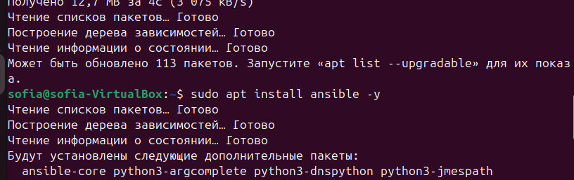
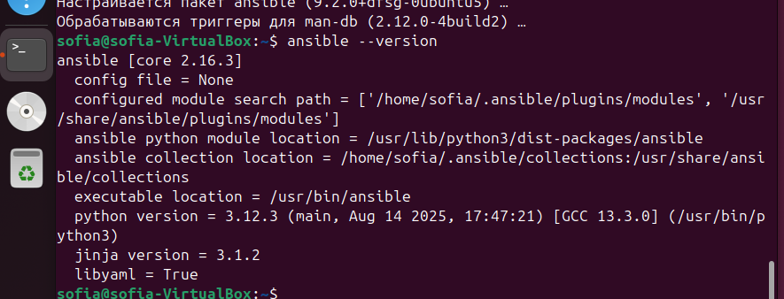
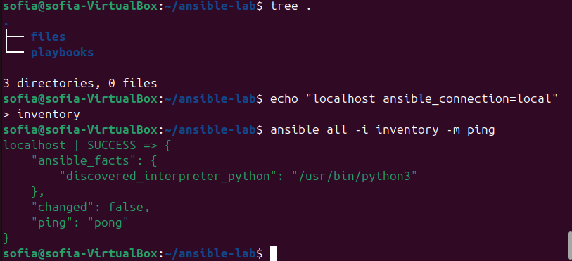
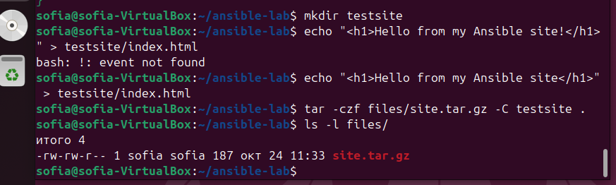
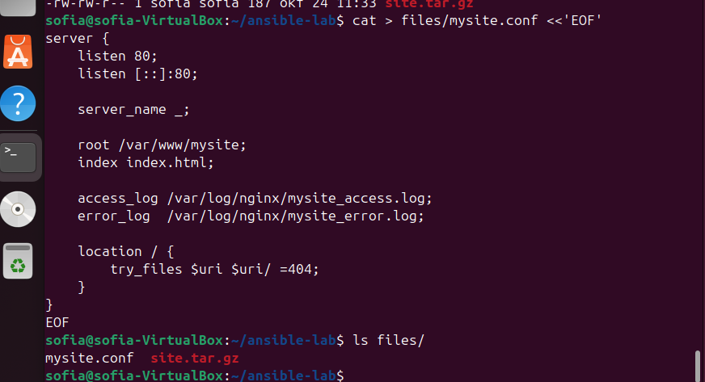
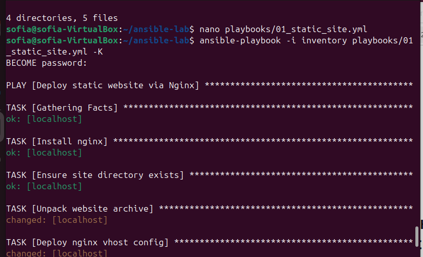
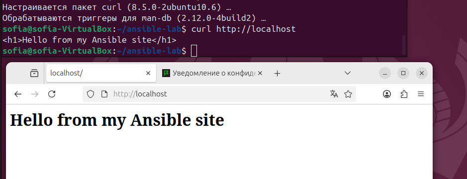
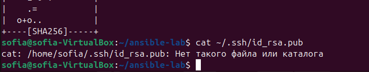
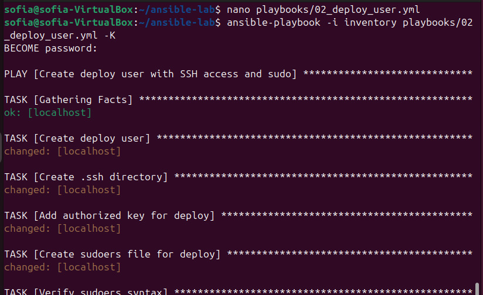
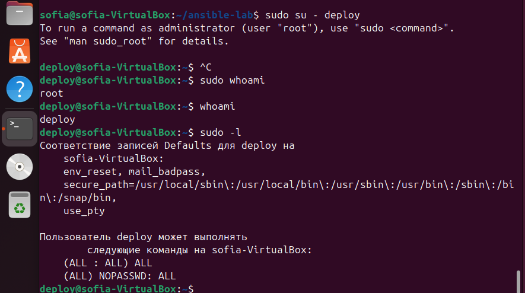

# Лабораторная работа №3
 
 - **Калинкова София, I2302** 
 - **24.10.2025** 

 ## Цель работы

Освоить практические навыки автоматизации настройки серверов с помощью `Ansible`.
В ходе работы требуется установить и запустить веб-сервер `Nginx`, автоматически развернуть простой статический сайт из архива, разместить его в соответствующей директории, а также настроить виртуальный хост для обслуживания веб-контента.
Результатом является работоспособный сайт, доступный по HTTP после выполнения плейбука.

## Теоретические сведения

`Ansible` — инструмент автоматизации администрирования. Работает по принципу push-модели: управляющая машина подключается к целевым по `SSH` и выполняет набор задач, описанных в `playbook` (файле YAML).

Основные понятия:
- *Playbook* — файл в формате YAML, описывающий последовательность задач.
- *Task* — конкретное действие (например, установка пакета, копирование файла).
- *Handler* — выполняется только при изменении конфигурации (например, перезапуск Nginx).
- *Module* — встроенная команда Ansible (apt, file, copy, unarchive, service и др.).
- *Inventory* — файл со списком управляемых хостов.

## Ход работы

### Плейбук 1. «Статический сайт через Nginx + распаковка архива»

**Цель:** ставим nginx, раскладываем свой мини-сайт из архива (`.tar.gz`) в web-директорию.  

#### Шаг 1. Установка Ansible

```bash
sudo apt update
sudo apt install ansible -y
```


Проверим:
```bash
ansible --version
```


#### Шаг 2. Подготовка рабочей директории

Создадим структуру проекта:
```bash
mkdir -p ~/ansible-lab/{playbooks,files}
cd ~/ansible-lab
```


#### Шаг 3. Создание inventory-файла

Ansible должен знать, с какими хостами работать. Для локальной ВМ достаточно прописать localhost:

```bash
echo "localhost ansible_connection=local" > inventory
```

Проверим подключение:
```bash
ansible all -i inventory -m ping
```


#### Шаг 4. Подготовка файлов сайта

Создадим тестовый сайт и упакуем его в архив.

```bash
mkdir testsite
echo "<h1>Hello from my Ansible site!</h1>" > testsite/index.html
tar -czf files/site.tar.gz -C testsite .
```

Проверка, что архив появился:
```bash
ls -l files/
```


#### Шаг 5. Создание nginx-конфига

Создан файл mysite.conf:
```bash
cat > files/mysite.conf <<'EOF'
server {
    listen 80;
    listen [::]:80;

    server_name _;

    root /var/www/mysite;
    index index.html;

    access_log /var/log/nginx/mysite_access.log;
    error_log  /var/log/nginx/mysite_error.log;

    location / {
        try_files $uri $uri/ =404;
    }
}
EOF
```

Проверка:
```bash
ls files/
```


#### Шаг 6. Создание плейбука

Теперь создадим файл `playbooks/01_static_site.yml`:
```bash
nano playbooks/01_static_site.yml
```

```bash
---
- name: Deploy static website via Nginx
  hosts: all
  become: true

  vars:
    site_root: /var/www/mysite
    files_dir: ../files       # <-- путь к файлам относительно playbook

  tasks:
    - name: Install nginx
      apt:
        name: nginx
        state: present
        update_cache: true

    - name: Ensure site directory exists
      file:
        path: "{{ site_root }}"
        state: directory
        mode: '0755'

    - name: Unpack website archive
      unarchive:
        src: "{{ files_dir }}/site.tar.gz"
        dest: "{{ site_root }}"
        remote_src: no
        owner: www-data
        group: www-data
      notify: Restart nginx

    - name: Deploy nginx vhost config
      copy:
        src: "{{ files_dir }}/mysite.conf"
        dest: /etc/nginx/sites-available/mysite.conf
        owner: root
        group: root
        mode: '0644'
      notify: Restart nginx

    - name: Enable site (symlink to sites-enabled)
      file:
        src: /etc/nginx/sites-available/mysite.conf
        dest: /etc/nginx/sites-enabled/mysite.conf
        state: link
      notify: Restart nginx

    - name: Disable default nginx site if exists
      file:
        path: /etc/nginx/sites-enabled/default
        state: absent
      notify: Restart nginx

  handlers:
    - name: Restart nginx
      service:
        name: nginx
        state: restarted

```

#### Запуск, указывая инвентори-файл:
```bash
ansible-playbook -i inventory playbooks/01_static_site.yml -K
```



- Плейбук корректно разворачивает статический сайт из архива.
- Nginx обслуживает сайт по HTTP.
- Все действия автоматизированы, ручная настройка не требуется


### Плейбук 2. «Пользователь деплоя + SSH-ключ + sudoers drop-in»

**Цель:** завести техпользователя без пароля, с входом по ключу и правами `sudo` через отдельный файл в `/etc/sudoers.d`.  

#### Шаг 1. Создание SSH-ключа на ВМ

```bash
ssh-keygen -t rsa -b 2048 -f ~/.ssh/deploy_id_rsa
```


#### Шаг 2. Создаём плейбук
```bash
nano playbooks/02_deploy_user.yml
```
содержимое плейбука

```bash
---
- name: Create deploy user with SSH access and sudo
  hosts: all
  become: true

  vars:
    deploy_user: deploy
    deploy_key: "ssh-rsa AAAAB3NzaC1yc2EAAAADAQABAAABAQCi... MY_KEY_"

  tasks:
    - name: Create deploy user
      user:
        name: "{{ deploy_user }}"
        groups: sudo
        append: yes
        shell: /bin/bash
        state: present

    - name: Create .ssh directory
      file:
        path: "/home/{{ deploy_user }}/.ssh"
        state: directory
        owner: "{{ deploy_user }}"
        group: "{{ deploy_user }}"
        mode: '0700'

    - name: Add authorized key for deploy
      authorized_key:
        user: "{{ deploy_user }}"
        key: "{{ deploy_key }}"
        state: present

    - name: Create sudoers file for deploy
      copy:
        dest: "/etc/sudoers.d/{{ deploy_user }}"
        content: "{{ deploy_user }} ALL=(ALL) NOPASSWD:ALL"
        owner: root
        group: root
        mode: '0440'

    - name: Verify sudoers syntax
      command: visudo -cf "/etc/sudoers.d/{{ deploy_user }}"
      register: sudo_check
      changed_when: false

    - name: Fail if sudoers syntax is invalid
      fail:
        msg: "Sudoers file has syntax errors!"
      when: sudo_check.rc != 0
```
В переменной deploy_key мой публичный SSH-ключ, который был создан на предыдушем шаге.

#### Запускаем плейбук:
```bash
ansible-playbook -i inventory playbooks/02_deploy_user.yml -K
```


#### Проверка

пользователь успешно создан, находится в системе (whoami → deploy) и может выполнять команды с правами root без пароля (sudo whoami → root, sudo -l показывает NOPASSWD).

### Вывод 
В ходе лабораторной работы был успешно развёрнут статический сайт на веб-сервере Nginx на виртуальной машине Ubuntu 24.04. Архив сайта был распакован в директорию /var/www/mysite, настроен минимальный виртуальный хост и активирован через sites-enabled. Проверка показала корректную работу веб-сервера и доступность сайта по IP ВМ.

Также был создан пользователь deploy с безопасным входом по SSH-ключу и правами sudo без запроса пароля через отдельный файл в /etc/sudoers.d. Проверки подтвердили, что пользователь может выполнять команды с привилегиями root, что обеспечивает возможность автоматизированного деплоя. Лабораторная работа показала эффективность Ansible для настройки инфраструктуры и развёртывания сервисов.