# Лабораторная работа №4. Автоматизация развертывания многоконтейнерного приложения с Docker Compose с использованием Ansible
 
 - **Калинкова София, I2302** 
 - **31.10.2025** 

 ## Цель работы

Закрепить знания по Docker и Docker Compose путем автоматизации их установки и развертывания на удаленных виртуальных машинах с помощью Ansible. Студенты научатся объединять инструменты конфигурационного управления (Ansible) с контейнеризацией (Docker), создавая reproducible инфраструктуру. Это позволит понять, как в реальных сценариях DevOps Ansible используется для оркестрации контейнеров на нескольких хостах.

## Ход работы

Использовались две виртуальные машины Ubuntu 24.04 в VirtualBox:

- Контроллер Ansible – с него выполнялись плейбуки.

- Docker-хост – на этой машине разворачивается WordPress + MySQL.

Применялся Сетевой мост, чтобы контроллер мог подключаться к Docker-хосту.

### Подготовка инфраструктуры

Проверяю версию Ansible на ВМ1
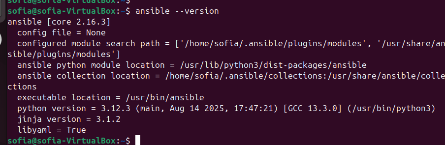

Так же на Docker-хосте настраиваю SSH-сервер:

```
sudo apt update
sudo apt install openssh-server -y
sudo systemctl enable ssh
sudo systemctl start ssh
sudo systemctl status ssh  # проверка, что сервис запущен
```

Статус running, значит все как надо
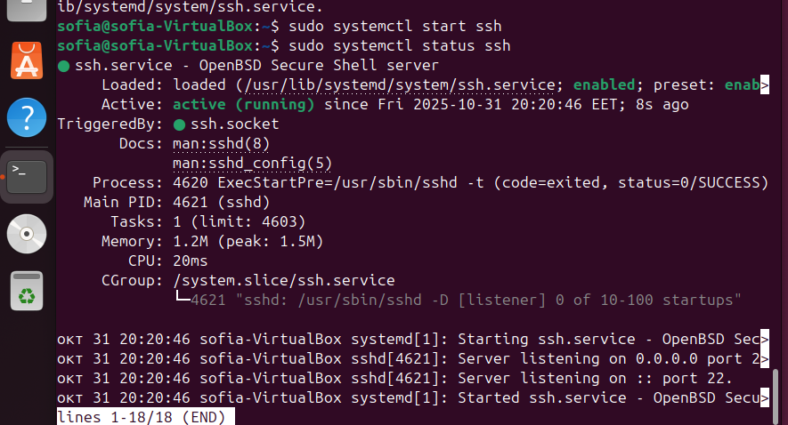

Также узнаю какой IP адрес у ВМ2:
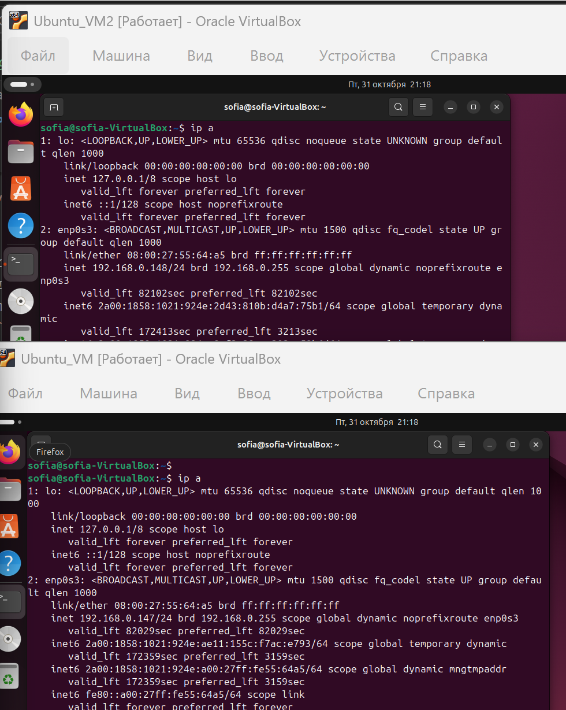

#### Настройка SSH

Сгенерирован ключ на контроллере:
```
ssh-keygen -t rsa
```

Скопирован публичный ключ на Docker-хост:
```
ssh-copy-id sofia@192.168.0.148
```
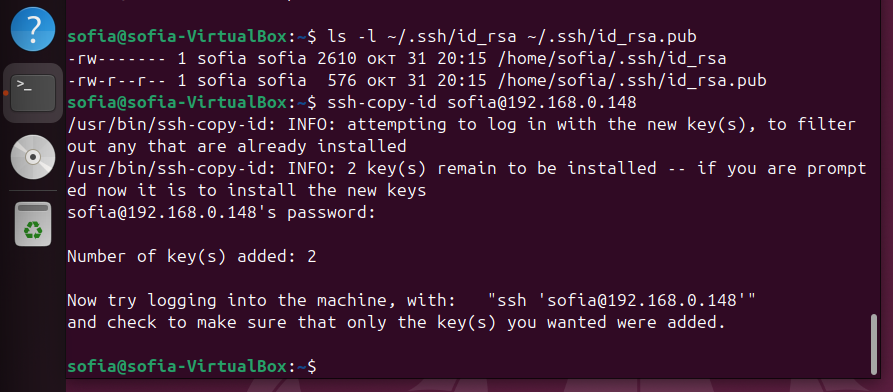

Проверка подключения без пароля:
```
ssh sofia@192.168.0.148
``` 
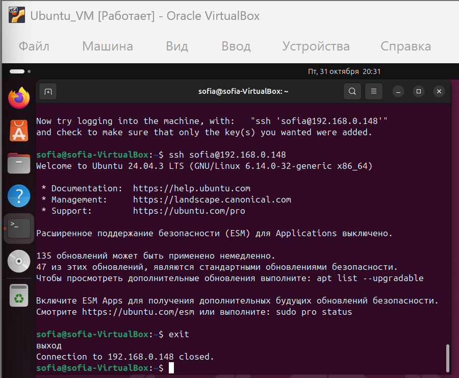

#### Создание папки для 4-й лабораторной

На ВМ1 c контроллером:
```
mkdir -p ~/ansible-lab4/{playbooks,files}
cd ~/ansible-lab4
```
- playbooks — для плейбуков Ansible
- files — для всех файлов, которые нужно копировать на ВМ2

#### Создание отдельного inventory-файла
```
nano ~/ansible-lab4/inventory
```

Содержимое:
```
[docker_hosts]
192.168.0.148 ansible_user=sofia
```

Проверка подключения:
```
ansible all -i ~/ansible-lab4/inventory -m ping
```
ответ pong от ВМ2.
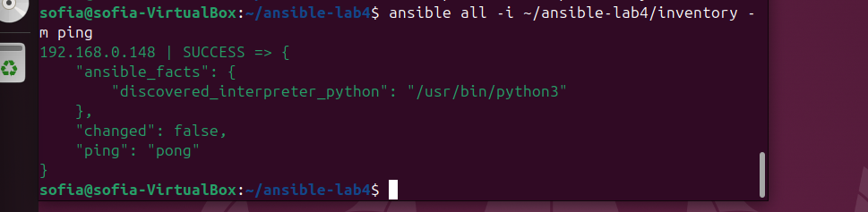


### Задание 1. Плейбук: установка Docker (install_docker.yml)

**Создание файла `install_docker.yml`:**
```
nano ~/ansible-lab4/playbooks/install_docker.yml
```
**Содержимое** [install_docker.yml](install_docker.yml)

**Запуск плейбука**
```
ansible-playbook -i ~/ansible-lab4/inventory ~/ansible-lab4/playbooks/install_docker.yml -K
```
`-K` — если нужен пароль sudo.

**Проверка установки на ВМ2**

Подключаемся к ВМ2:
```
ssh sofia@192.168.0.148
```
Проверяем:
```
docker --version
docker compose version
```

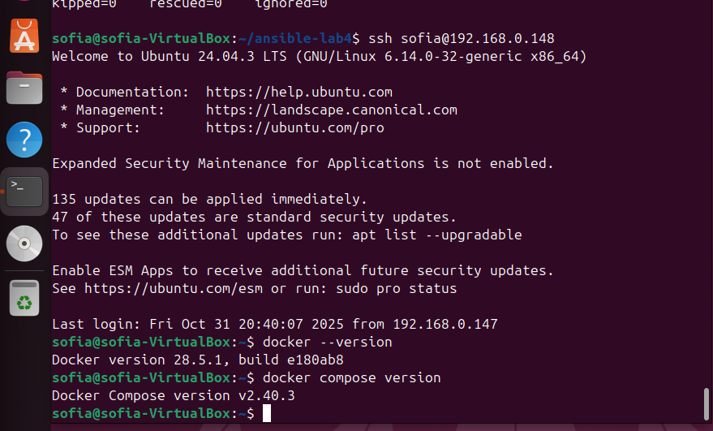

### Задание 2. Создание Docker Compose файла для многоконтейнерного приложения

**Создание файла docker-compose.yml**
```
nano ~/ansible-lab4/files/docker-compose.yml
```
**Содержимое** [docker-compose.yml](docker-compose.yml)

Попытка протестировать Compose локально, но Docker не установлен на хосте:
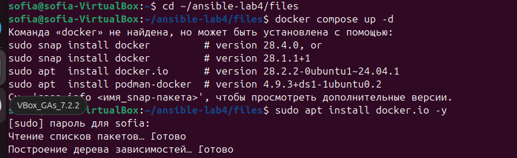

### Задание 3. Автоматизация развертывания Docker Compose с помощью Ansible

Плейбук для деплоя Compose (deploy_compose.yml)

**Создание файла:**
```
nano ~/ansible-lab4/playbooks/deploy_compose.yml
```

**Содержимое:** [deploy_compose.yml](deploy_compose.yml)

**Запуск плейбука**
```
ansible-playbook -i ~/ansible-lab4/inventory ~/ansible-lab4/playbooks/deploy_compose.yml -K
```
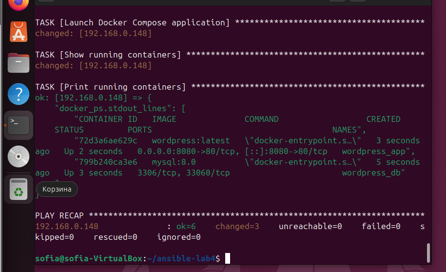

После успешного выполнения захожу в браузере http://192.168.0.148:8080

Открылся экран установки WordPress

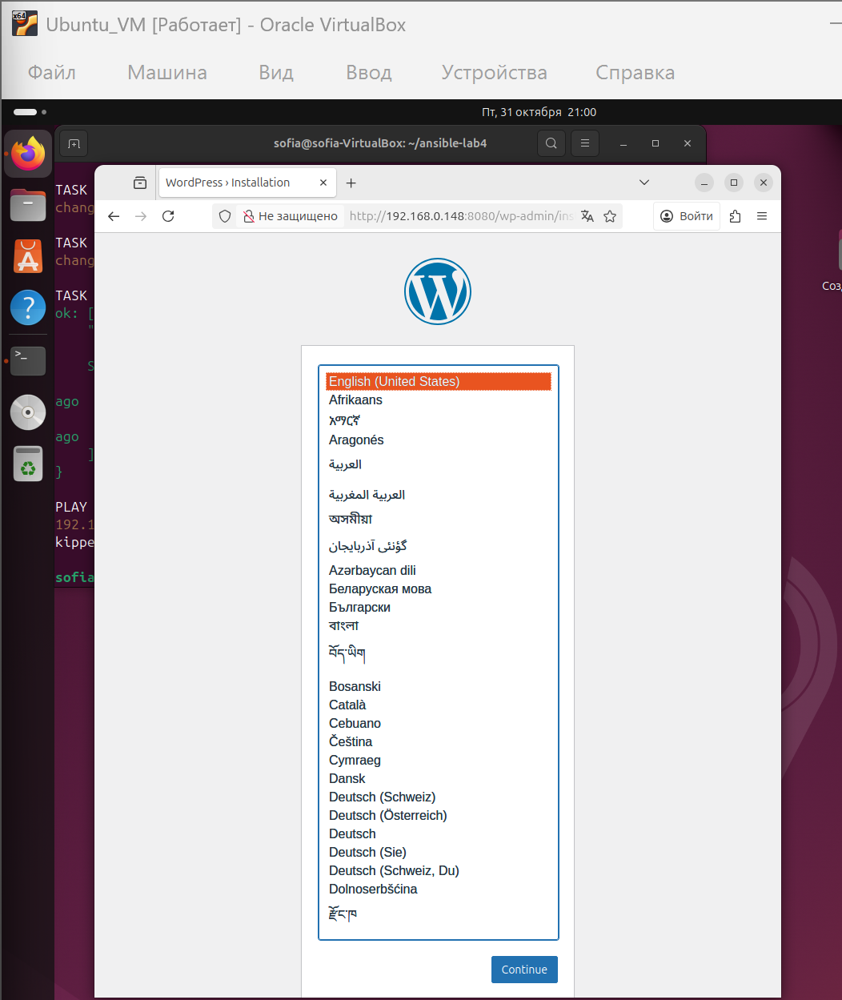

**Проверка состояния контейнеров на удалённой ВМ**

После выполнения playbook deploy_compose.yml для развёртывания WordPress и MySQL, была подключена ВМ1 к ВМ2 через SSH:
```
ssh sofia@192.168.0.148
```
На удалённой ВМ2 проверено состояние контейнеров с помощью команды:
```
docker ps
```
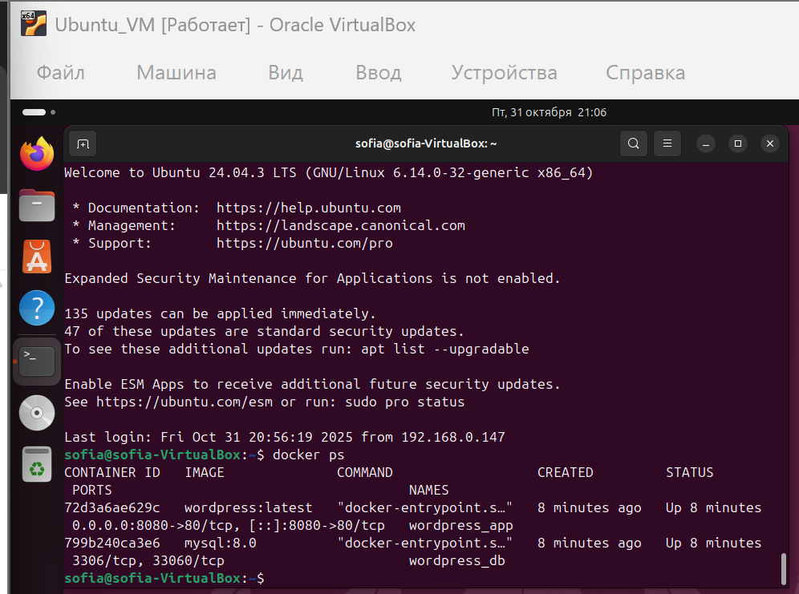

Стек WordPress + MySQL успешно развернут на удалённой ВМ с помощью Ansible.

### Вывод:

В лабораторной работе настроены две Ubuntu 24.04 ВМ, на одной установлен SSH-сервер. С помощью Ansible автоматически установлен Docker и развернут стек WordPress + MySQL через Docker Compose. Контейнеры запущены и работают корректно. Плейбуки показали удобство автоматизации развертывания приложений.