# Лабораторная работа №5. Расширенный пайплайн в GitLab CI для Laravel
 
 - **Калинкова София, I2302** 
 - **14.11.2025** 

## Цель работы

Получить практический опыт настройки собственного CI/CD-сервера с GitLab Community Edition и реализации конвейера для Laravel-приложения, включая тестирование, сборку Docker-образа и (опционально) деплой. Вы установите GitLab CE, создадите проект с `.gitlab-ci.yml`, настроите Runner и запустите пайплайн.

---

### Шаги выполнения:

#### 1. Развертывание GitLab CE
- Поднимите виртуальную машину с Ubuntu 22.04 Server (например, через VirtualBox с минимум 4 GB RAM и 2 ядрами).
- Установите GitLab CE через Docker:
  ```bash
	docker run -d \
	  --hostname 192.168.100.75 \
	  -p 80:80 \
	  -p 443:443 \
	  -p 8022:22 \
	  --name gitlab \
	  -e GITLAB_OMNIBUS_CONFIG="external_url='http://192.168.100.75'; gitlab_rails['gitlab_shell_ssh_port']=8022" \
	  -v gitlab-data:/var/opt/gitlab \
	  -v ~/gitlab-config:/etc/gitlab \
	  gitlab/gitlab-ce:latest
  ```

  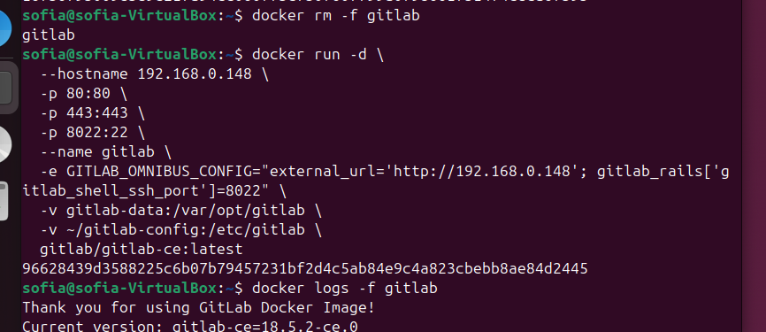


  - Замените `192.168.100.75` на IP вашей VM (проверьте с `ip addr show`).
  - Проверьте логи: `docker logs -f gitlab` и дождитесь строки "GitLab is ready".
- Откройте браузер на `http://192.168.100.75`.
- Установите пароль для `root` (появится при первом входе) или проверьте его:
  ```bash
  docker exec -it gitlab cat /etc/gitlab/initial_root_password
  ```
  
  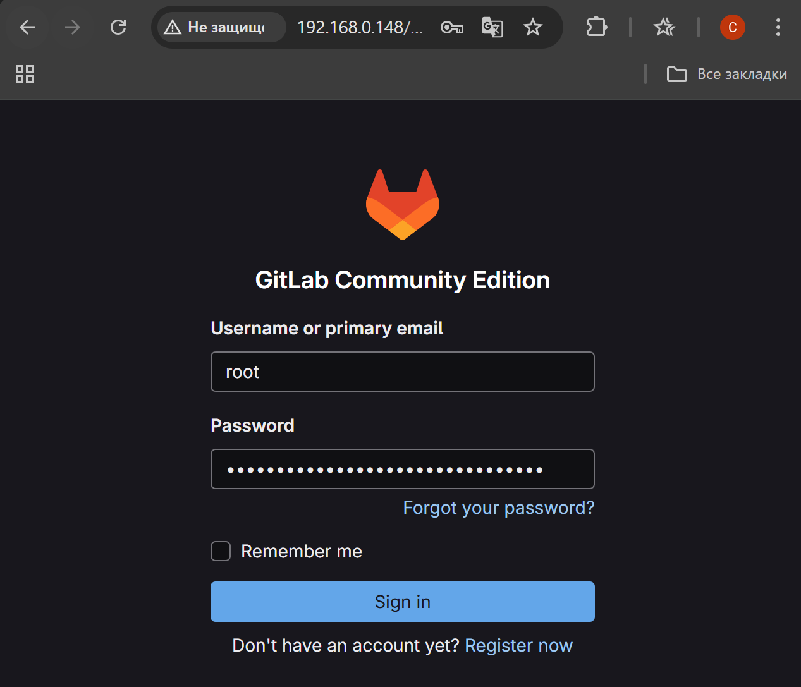
  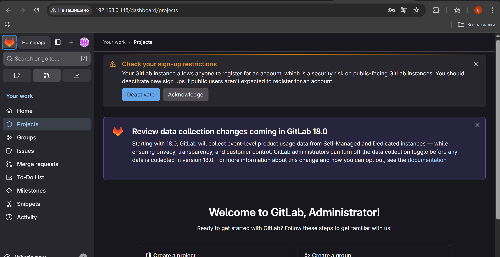


#### 2. Настройка Runner
- GitLab не имеет встроенных Runner'ов, поэтому зарегистрируйте его на той же VM или отдельной машине.
- Установите GitLab Runner:
  ```bash
  curl -L "https://packages.gitlab.com/install/repositories/runner/gitlab-runner/script.deb.sh" | sudo bash
  sudo apt-get install -y gitlab-runner
  ```
  

- Зарегистрируйте Runner:
  - В GitLab перейдите в **Admin Area > CI/CD > Runners > New instance runner**.
  - Заполните поля (Description, Tags, Executor — выберите "docker"), нажмите **Create runner**.
  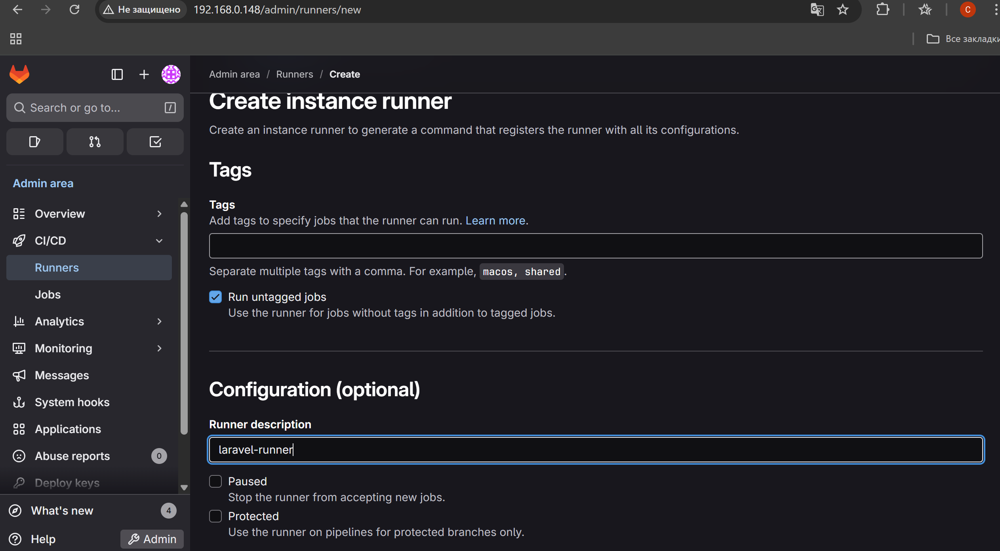
  - Поставьте галочку возле Run untagged jobs
  - Скопируйте **Authentication Token** (с префиксом `glrt-`).
  - Выполните регистрацию:
    ```bash
    gitlab-runner register \
      --url "http://<vm_ip>:8080" \
      --token "<your_authentication_token>" \
      --executor "docker" \
      --docker-image "php:8.2-cli" \
      --description "laravel-runner"
      
    gitlab-runner run
    ```
    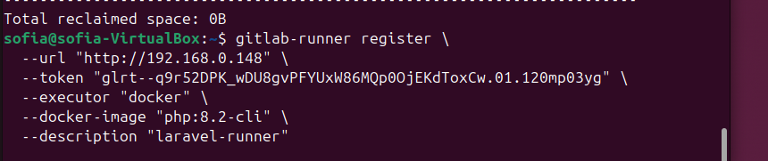
    
  - Убедитесь, что Runner активен: `sudo gitlab-runner status`.


#### 3. Создание проекта и репозитория в GitLab
- Создайте новый проект: **Repository > New > Create blank project** (назовие, например, `laravel-app`).


- Клонируйте репозиторий локально:
  ```bash
  git clone http://192.168.100.75:8080/root/laravel-app.git ~/laravel-app
  cd ~/laravel-app
  ```
  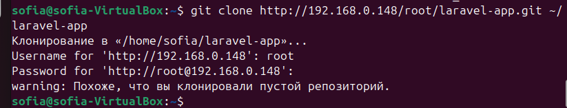
- Настройте Laravel-проект:
  - Скачайте Laravel-проект в другую папку https://github.com/laravel/laravel и скопируйте содержимое с папку с проектом
```bash
cp laravel/* laravel-app/ -r
```

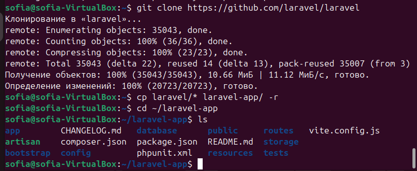


  - Создайте `Dockerfile` для сборки:
    ```dockerfile
    # Используем официальный образ PHP с Apache
    FROM php:8.2-apache

    # Устанавливаем зависимости
    RUN apt-get update && apt-get install -y \
        libpng-dev libonig-dev libxml2-dev \
        && docker-php-ext-install pdo_mysql mbstring exif pcntl bcmath

    # Устанавливаем Composer
    COPY --from=composer:latest /usr/bin/composer /usr/bin/composer

    # Копируем код приложения
    COPY . /var/www/html
    RUN composer install --no-scripts --no-interaction
    RUN chown -R www-data:www-data /var/www/html/storage /var/www/html/bootstrap/cache
    RUN chmod -R 775 /var/www/html/storage

    # Настраиваем Apache
    RUN a2enmod rewrite
    EXPOSE 80

    CMD ["apache2-foreground"]
    ```

    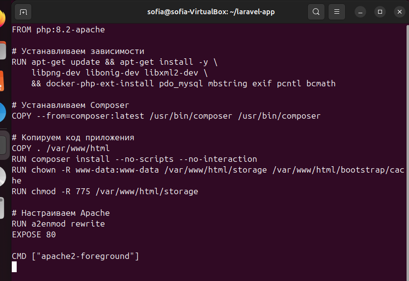

  - Создайте `.env.testing` для тестов (например, с пустой базой данных):
    ```env
	APP_NAME=Laravel
	APP_ENV=testing
	APP_KEY=
	APP_DEBUG=true
	APP_URL=http://localhost
	APP_LOCALE=en
	APP_FALLBACK_LOCALE=en
	APP_FAKER_LOCALE=en_US
	APP_MAINTENANCE_DRIVER=file
	# APP_MAINTENANCE_STORE=database
	PHP_CLI_SERVER_WORKERS=4
	BCRYPT_ROUNDS=12
	LOG_CHANNEL=stack
	LOG_STACK=single
	LOG_DEPRECATIONS_CHANNEL=null
	LOG_LEVEL=debug
	DB_CONNECTION=mysql
	DB_HOST=mysql
	DB_PORT=3306
	DB_DATABASE=laravel_test
	DB_USERNAME=root
	DB_PASSWORD=root
	SESSION_DRIVER=database
	SESSION_LIFETIME=120
	SESSION_ENCRYPT=false
	SESSION_PATH=/
	SESSION_DOMAIN=null
	BROADCAST_CONNECTION=log
	FILESYSTEM_DISK=local
	QUEUE_CONNECTION=database
	CACHE_STORE=database
	# CACHE_PREFIX=
	MEMCACHED_HOST=127.0.0.1
	REDIS_CLIENT=phpredis
	REDIS_HOST=127.0.0.1
	REDIS_PASSWORD=null
	REDIS_PORT=6379
	MAIL_MAILER=log
	MAIL_SCHEME=null
	MAIL_HOST=127.0.0.1
	MAIL_PORT=2525
	MAIL_USERNAME=null
	MAIL_PASSWORD=null
	MAIL_FROM_ADDRESS="hello@example.com"
	MAIL_FROM_NAME="${APP_NAME}"
    ```
  - Добавьте тесты (если их нет, создайте простой тест в `tests/Unit/ExampleTest.php`):
    ```php
    <?php
    namespace Tests\Unit;
    use PHPUnit\Framework\TestCase;
    class ExampleTest extends TestCase
    {
        public function testBasicTest()
        {
            $this->assertTrue(true);
        }
    }
    ```
    был тест но решила поменять

  - Создайте `.gitlab-ci.yml` в корне проекта:
    ```yaml
	stages:
	  - test
	  - build
	services:
	  - mysql:8.0
	variables:
	  MYSQL_DATABASE: laravel_test
	  MYSQL_ROOT_PASSWORD: root
	  DB_HOST: mysql
	test:
	  stage: test
	  image: php:8.2-cli
	  before_script:
	    - apt-get update -yqq
	    - apt-get install -yqq libpng-dev libonig-dev libxml2-dev libzip-dev unzip git
	    - docker-php-ext-install pdo_mysql mbstring exif pcntl bcmath
	    - curl -sS https://getcomposer.org/installer | php -- --install-dir=/usr/local/bin --filename=composer
	    - composer install --no-scripts --no-interaction
	    - cp .env.testing .env
	    - php artisan key:generate
	    - php artisan migrate --seed
	    - cp .env .env.testing
	    - php artisan config:clear
	  script:
	    - vendor/bin/phpunit
	  after_script:
	    - rm -f .env

    ```


    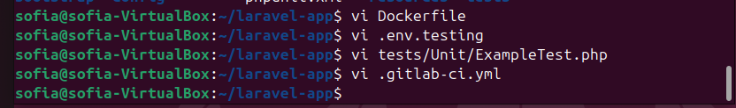
  - Закоммитьте и пушьте:
    ```
    git add .
    git commit -m "Add Laravel app with CI/CD config"
    git push -u origin main
    ```
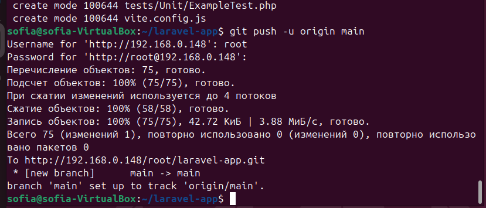

По желанию можно добавить еще одну стадию для деплоя проекта на другю виртуальную машину.

#### 4. Запуск и проверка конвейера
- Перейдите в **CI/CD > Pipelines** в проекте.
- Пайплайн запустится автоматически. Статус изменится с `pending` на `running`.
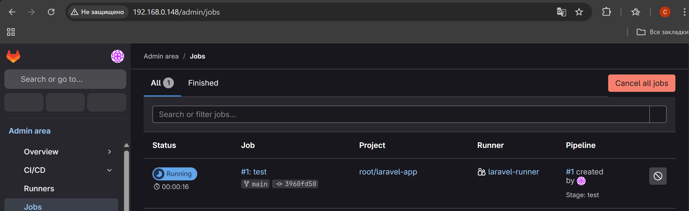
- Проверьте логи каждого job (`test` и `build`):
  - `test`: Должен пройти PHPUnit-тест.


- Если статус `pending` долго висит:
  - Убедитесь, что Runner активен (`sudo gitlab-runner status`).
  - Проверьте теги в `.gitlab-ci.yml` и настройках Runner'а.
- Исправляйте ошибки в `.gitlab-ci.yml` или коде, делайте `git push` для повторного запуска.


#### 5. Итог проверки
- У вас должен быть работающий GitLab с проектом Laravel, где пайплайн выполняет тесты (PHPUnit).
- Проверьте **Packages & Registries > Container Registry** — образ должен быть доступен.
- История пайплайнов отобразится в **CI/CD > Pipelines**.


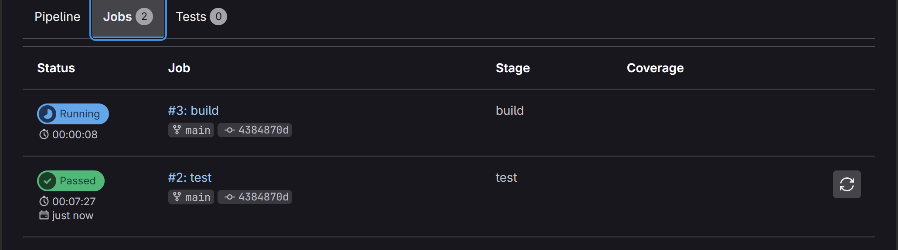


ГРУСТЬ ТОСКА НЕВЕРОЯТНАЯ

